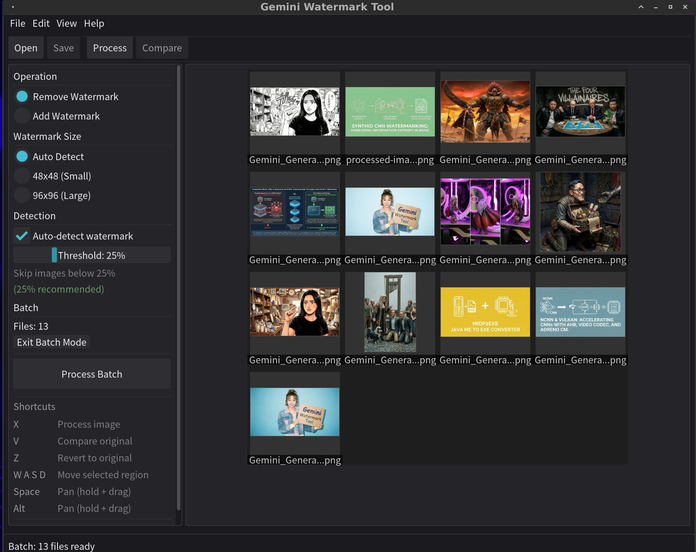

# Gemini Watermark Tool

> ## 📌 Original Author Notice (Reverse Alpha Blending)
> I am the original author of **GeminiWatermarkTool** and the reverse **alpha-blending** restoration method used to remove the visible "Gemini" watermark while preserving image detail (Allen Kuo / allenk).
>
> This project achieves high-precision restoration by using my calibrated **48×48** and **96×96** **Reverse-Alpha Masks** to invert the blending equation. Since I published this work and these assets, many derivative tools (desktop apps, websites, browser extensions, etc.) have appeared using the same approach and/or directly reusing the masks produced by this project — because the method is deterministic and highly effective.
>
> ✅ **MIT License reminder**  
> This project is released under the **MIT License**. Commercial use and ports are allowed.  
> However, if you **redistribute** any substantial portion of this project (including code or mask assets), you must:
> - Preserve the original **copyright notice**
> - Include the full **MIT license text**
> - (Recommended) Provide attribution with a link back to this repository
>
> 📖 For the full technical write-up (including how the Reverse-Alpha Masks were derived and calibrated), see:  
> **Removing Gemini AI Watermarks: A Deep Dive into Reverse Alpha Blending**  
> https://allenkuo.medium.com/removing-gemini-ai-watermarks-a-deep-dive-into-reverse-alpha-blending-bbbd83af2a3f

Gemini Watermark Tool removes Gemini visible watermarks from images using **mathematically accurate reverse alpha blending**. Available as both a **command-line tool** and a **graphical desktop application**.

- **Fast & offline**: single executable, **zero dependencies**
- **GUI + CLI**: desktop app with drag & drop, or command-line for automation
- **Smart detection**: three-stage NCC algorithm with confidence scoring — skip non-watermarked images automatically
- **Batch processing**: process entire directories with thumbnail preview and progress tracking
- **Cross-platform**: Windows / Linux / macOS / Android (CLI)

## 🖥️ GUI Application — Major Update

> **GeminiWatermarkTool now comes with a full graphical desktop application.**
> No command line needed — just open, drag & drop, and process. Supports single-image editing with real-time preview, and batch processing with smart watermark detection.

The desktop GUI provides an interactive workflow for both single-image and batch operations.



### Single Image Editing

<!-- TODO: Replace with actual GIF -->


- Drag & drop or open any supported image
- Auto-detect watermark size (48×48 / 96×96) or select manually
- **Custom watermark mode**: draw a region interactively, resize with 8-point anchors, fine-tune position with WASD keys
- Real-time before/after comparison (press **V**)
- One-key processing (**X**) and revert (**Z**)
- Zoom, pan (Space/Alt + drag, mouse wheel), and fit-to-window

### Batch Processing

<!-- TODO: Replace with actual GIF -->


- **Drag & drop** multiple files or an **entire folder** to enter batch mode
- Thumbnail atlas preview with filename labels and status overlays (OK / SKIP / FAIL)
- **Detection threshold slider** (0–100%, 5% steps, 25% recommended) — automatically skip images without watermarks
- Confirmation dialog before overwriting originals
- Non-blocking processing with progress bar and scrollable result log
- Thumbnails refresh after completion to show processed results

### Keyboard Shortcuts

| Key | Action |
|-----|--------|
| X | Process image |
| V | Compare with original |
| Z | Revert to original |
| W A S D | Move custom watermark region |
| Space / Alt | Pan (hold + drag) |
| Ctrl+W | Close / exit batch mode |

### Render Backends (Windows)

The GUI supports multiple render backends for maximum compatibility:

| Backend | Description | Use Case |
|---------|-------------|----------|
| **D3D11** (default) | Direct3D 11 with WARP fallback | Best for Windows — works in Hyper-V, Docker, RDP |
| **OpenGL** | OpenGL 3.3 Core | Cross-platform, requires GPU drivers |

**Why D3D11?**
- Native Windows API — no additional drivers needed
- **WARP fallback** — software rendering when no GPU available
- Works in **Hyper-V**, **Docker**, **Remote Desktop**, and other virtualized environments
- Better stability in Windows sandbox configurations

```bash
# Auto-select (D3D11 on Windows, OpenGL elsewhere)
GeminiWatermarkTool

# Force specific backend
GeminiWatermarkTool --backend=d3d11
GeminiWatermarkTool --backend=opengl
```

## CLI — What's New

In addition to the GUI, the command line has been significantly enhanced.

### Simple Mode — Now Supports Multiple Files

```bash
# Process multiple files at once (new!)
GeminiWatermarkTool img1.jpg img2.png img3.webp
```

Watermark detection is **enabled by default** in simple mode — images without a detectable watermark are automatically skipped to prevent accidental damage.

```bash
# Force processing without detection
GeminiWatermarkTool --force image.jpg

# Custom detection threshold (default: 25%)
GeminiWatermarkTool --threshold 0.40 image.jpg
```

### Standard Mode

```bash
# Single file with explicit output
GeminiWatermarkTool -i input.jpg -o output.jpg

# Batch directory processing
GeminiWatermarkTool -i ./watermarked_images/ -o ./clean_images/
```

## Watermark Detection

> Inspired by [@dannycreations](https://github.com/dannycreations)'s [contribution](https://github.com/allenk/GeminiWatermarkTool/pull/13) on watermark presence detection. We took the concept further with a production-grade three-stage algorithm deeply integrated into both CLI and GUI workflows.

Batch processing watermark-free images can cause unnecessary pixel damage. The tool now uses a **three-stage NCC (Normalized Cross-Correlation)** algorithm to detect watermarks before processing, ensuring only watermarked images are modified:

1. **Spatial NCC** — correlates the image region with the known alpha map (50% weight, with circuit breaker at 0.25 to short-circuit obvious non-matches)
2. **Gradient NCC** — Sobel edge matching to detect the star-shaped structural pattern (30% weight)
3. **Statistical Variance** — texture dampening analysis to distinguish real watermarks from white/flat regions (20% weight)

A combined confidence score determines whether a watermark is present. The default threshold is **25%** — images below this score are skipped. This eliminates false positives from white backgrounds or similar-looking content that plagued simpler correlation-based approaches.

| Flag | Effect |
|------|--------|
| `--force` | Skip detection, process all images unconditionally |
| `--threshold 0.40` | Set custom confidence threshold (0.0–1.0) |
| `--no-banner` | Hide ASCII banner (for scripts and AI agents) |
| `--banner` | Force show ASCII banner |

Detection is **enabled by default** in simple/drag-and-drop mode and **disabled by default** in standard (`-i` / `-o`) mode. In the GUI, the threshold is adjustable via a slider (0–100%, 5% steps) with a recommended 25% default.

## Demo


## Side by Side Comparison


Best for: **slides, documents, UI screenshots, diagrams, logos**.

**Focus on the bottom example (text-heavy slide).**  
Generative inpainting often breaks text: warped edges, wrong spacing, invented strokes.  
GeminiWatermarkTool reverses the blending equation to recover pixels, keeping text crisp.

---

## ⚠️ About SynthID (Invisible Watermark)

> **Important**: This tool removes **visible watermarks only**. It does NOT remove SynthID.

### What is SynthID?

SynthID is Google DeepMind's **invisible watermarking** technology embedded in AI-generated images. Unlike visible watermarks:

- **Invisible** to human eyes
- **Integrated** during generation (not added afterward)  
- **Extremely robust** against common image manipulations

### Why Can't SynthID Be Removed?

Our extensive research revealed a fundamental truth:

> **SynthID is not a watermark added to an image — it IS the image.**

SynthID operates as a **Statistical Bias** during generation. Every pixel choice is subtly influenced by Google's private key using **Tournament Sampling**. The watermark and visual content are **inseparably bound**.

```
Visible Watermark:  Image + Overlay = Result     ✓ Removable (this tool)
SynthID:            Biased Generation = Image    ✗ Cannot separate
```

### Potential Removal Approaches

| Approach | Trade-off | Feasibility |
|----------|-----------|-------------|
| **Extreme Quantization** (binarization) | Image becomes unusable skeleton | ✓ Works |
| **AI Repaint** (Stable Diffusion, etc.) | Style changes significantly | ✓ Works |
| **White-box Adversarial Attack** | Requires detector model | ✗ Not available |

**Conclusion**: Removing SynthID while preserving image quality is **currently not feasible**.

📄 **[Full SynthID Research Report →](report/synthid_research.md)**
- [SynthID Image Watermark Research Report](https://allenkuo.medium.com/synthid-image-watermark-research-report-9b864b19f9cf)

---

## Download

Download the latest release from the [Releases](https://github.com/allenk/GeminiWatermarkTool/releases) page.

| Platform | File | Architecture |
|----------|------|--------------|
| Windows | `GeminiWatermarkTool-Windows-x64.exe` | x64 |
| Linux | `GeminiWatermarkTool-Linux-x64` | x64 |
| macOS | `GeminiWatermarkTool-macOS-Universal` | Intel + Apple Silicon |
| Android | `GeminiWatermarkTool-Android-arm64` | ARM64 |

## ⚠️ Disclaimer

> **USE AT YOUR OWN RISK**
>
> This tool modifies image files. While it is designed to work reliably, unexpected results may occur due to:
> - Variations in Gemini's watermark implementation
> - Corrupted or unusual image formats
> - Edge cases not covered by testing
>
> **Always back up your original images before processing.**
>
> The author assumes no responsibility for any data loss, image corruption, or unintended modifications. By using this tool, you acknowledge that you understand these risks.

## CLI — Quick Start


Don't need the GUI? The CLI is designed for **maximum simplicity** — one drag, one drop, done.

### Drag & Drop (Windows) — The Easiest Way

1. Download `GeminiWatermarkTool-Windows-x64.exe`
2. Drag an image file onto the executable
3. ✅ Done! The watermark is removed in-place — no terminal, no arguments

<!-- CLI Preview -->


### Command Line

```bash
# Simple mode - just provide a filename
GeminiWatermarkTool watermarked.jpg

# Specify output file (preserves original)
GeminiWatermarkTool -i watermarked.jpg -o clean.jpg

# Batch processing - entire directory
GeminiWatermarkTool -i ./input_folder/ -o ./output_folder/
```

Supported formats: `.jpg`, `.jpeg`, `.png`, `.webp`, `.bmp`

> ⚠️ **Warning**: Simple mode overwrites the original file permanently. **Always back up important images before processing.**

## Command Line Options

| Option | Short | Description |
|--------|-------|-------------|
| `--input <path>` | `-i` | Input image file or directory |
| `--output <path>` | `-o` | Output image file or directory |
| `--remove` | `-r` | Remove watermark (default behavior) |
| `--force` | `-f` | Force processing (skip watermark detection) |
| `--threshold <val>` | `-t` | Detection confidence threshold, 0.0–1.0 (default: 0.25) |
| `--force-small` | | Force 48×48 watermark size |
| `--force-large` | | Force 96×96 watermark size |
| `--verbose` | `-v` | Enable verbose output |
| `--quiet` | `-q` | Suppress all output except errors |
| `--banner` | `-b` | Show full ASCII banner |
| `--version` | `-V` | Show version information |
| `--help` | `-h` | Show help message |

## Watermark Size Detection

The tool automatically detects the appropriate watermark size based on image dimensions:

| Image Size | Watermark | Position |
|------------|-----------|----------|
| W ≤ 1024 **or** H ≤ 1024 | 48×48 | Bottom-right, 32px margin |
| W > 1024 **and** H > 1024 | 96×96 | Bottom-right, 64px margin |

Use `--force-small` or `--force-large` to override automatic detection.

## System Requirements

| Platform | Requirements |
|----------|--------------|
| Windows | Windows 10/11 x64 |
| Linux | x64, glibc 2.35+ (Ubuntu 22.04+, Debian 12+) |
| macOS | macOS 11.0+ (Intel or Apple Silicon) |
| Android | ARM64, Android 10+ (API 29+) |

All binaries are statically linked with no external runtime dependencies.

## Troubleshooting

### "The image doesn't look different after processing"

The watermark is semi-transparent. If the original background was similar to the watermark color, the difference may be subtle. Try viewing at 100% zoom in the watermark area (bottom-right corner).

### "Wrong watermark size detected"

Use `--force-small` or `--force-large` to manually specify:

```bash
GeminiWatermarkTool -i image.jpg -o output.jpg --force-small
```

### "File access denied"

Make sure the output path is writable and the file isn't open in another program.

## Limitations

- Only removes **Gemini visible watermarks** (the semi-transparent logo in bottom-right)
- Does **NOT** remove **SynthID invisible watermarks** — [see why](report/synthid_research.md)
- Designed for Gemini's current watermark pattern (as of 2025)

---

## Building from Source

### Prerequisites

| Tool | Version | Notes |
|------|---------|-------|
| CMake | 3.21+ | For CMakePresets support |
| C++ Compiler | C++20 | MSVC 2022, GCC 12+, Clang 14+ |
| vcpkg | Latest | Package manager |
| Ninja | Latest | Recommended build system |

### Setup vcpkg

```bash
# Clone vcpkg
git clone https://github.com/microsoft/vcpkg.git
cd vcpkg

# Bootstrap
./bootstrap-vcpkg.sh    # Linux/macOS
.\bootstrap-vcpkg.bat   # Windows

# Set environment variable
export VCPKG_ROOT="$HOME/vcpkg"       # Linux/macOS (add to .bashrc)
$env:VCPKG_ROOT = "C:\vcpkg"          # Windows PowerShell
```

### Build with CMake Presets

The project uses `CMakePresets.json` for cross-platform configuration.

```bash
# List available presets
cmake --list-presets
```

#### Windows

```powershell
cmake --preset windows-x64-Release
cmake --build --preset windows-x64-Release
```

#### Linux

```bash
cmake --preset linux-x64-Release
cmake --build --preset linux-x64-Release
```

#### macOS (Universal Binary)

macOS requires separate builds for each architecture:

```bash
# Build x64
cmake -B build-x64 -G Ninja \
  -DCMAKE_BUILD_TYPE=Release \
  -DCMAKE_TOOLCHAIN_FILE=$VCPKG_ROOT/scripts/buildsystems/vcpkg.cmake \
  -DVCPKG_TARGET_TRIPLET=x64-osx \
  -DCMAKE_OSX_ARCHITECTURES=x86_64
cmake --build build-x64

# Build arm64
cmake -B build-arm64 -G Ninja \
  -DCMAKE_BUILD_TYPE=Release \
  -DCMAKE_TOOLCHAIN_FILE=$VCPKG_ROOT/scripts/buildsystems/vcpkg.cmake \
  -DVCPKG_TARGET_TRIPLET=arm64-osx \
  -DCMAKE_OSX_ARCHITECTURES=arm64
cmake --build build-arm64

# Create Universal Binary
lipo -create build-x64/GeminiWatermarkTool build-arm64/GeminiWatermarkTool \
  -output GeminiWatermarkTool
```

#### Android

Requires Android NDK:

```bash
export ANDROID_NDK_HOME="/path/to/android-ndk"

cmake --preset android-arm64-Release
cmake --build --preset android-arm64-Release
```

### Build Presets

| Preset | Platform | Backend | Notes |
|--------|----------|---------|-------|
| `windows-x64-Release` | Windows | D3D11 + OpenGL | Default, best compatibility |
| `windows-x64-OpenGL-Release` | Windows | OpenGL only | For GPU-accelerated OpenGL |
| `linux-x64-Release` | Linux | OpenGL | — |
| `mac-universal-Release` | macOS | OpenGL | Intel + Apple Silicon |
| `android-arm64-Release` | Android | — | CLI only |

### Manual Build (without presets)

```bash
cmake -B build -G Ninja \
  -DCMAKE_BUILD_TYPE=Release \
  -DCMAKE_TOOLCHAIN_FILE=$VCPKG_ROOT/scripts/buildsystems/vcpkg.cmake \
  -DVCPKG_TARGET_TRIPLET=x64-linux

cmake --build build
```

---

## Project Structure

```
gemini-watermark-tool/
├── CMakeLists.txt              # Main build configuration
├── CMakePresets.json           # Cross-platform build presets
├── vcpkg.json                  # Dependencies manifest
├── src/
│   ├── core/                   # Core engine (CLI + GUI shared)
│   │   ├── watermark_engine.hpp/cpp
│   │   ├── watermark_detector.hpp/cpp
│   │   ├── blend_modes.hpp/cpp
│   │   └── types.hpp
│   ├── cli/                    # CLI application
│   │   └── cli_app.hpp/cpp
│   ├── utils/                  # Utilities
│   │   ├── ascii_logo.hpp
│   │   └── path_formatter.hpp
│   ├── main.cpp                # Entry point (CLI/GUI dispatcher)
│   └── gui/                    # Desktop GUI (ImGui + SDL3)
│       ├── gui_app.hpp/cpp           # GUI entry point
│       ├── app/
│       │   ├── app_state.hpp         # Application state
│       │   └── app_controller.hpp/cpp # Logic controller
│       ├── widgets/
│       │   ├── main_window.hpp/cpp   # Main window + menus
│       │   └── image_preview.hpp/cpp # Image viewer + batch view
│       ├── backend/
│       │   ├── render_backend.hpp/cpp  # Backend interface + factory
│       │   ├── opengl_backend.hpp/cpp  # OpenGL 3.3 implementation
│       │   └── d3d11_backend.hpp/cpp   # Direct3D 11 implementation (Windows)
│       └── resources/
│           └── style.hpp             # Theme and layout constants
├── report/
│   └── synthid_research.md     # SynthID research documentation
└── resources/
    ├── app.ico                 # Windows application icon
    └── app.rc.in               # Windows resource template
```

## Dependencies

All dependencies are managed via vcpkg and statically linked:

| Package | Purpose |
|---------|---------|
| OpenCV | Image I/O and pixel operations |
| fmt | Modern string formatting |
| CLI11 | Command line argument parsing |
| spdlog | Logging framework |
| SDL3 | Window management and input (GUI) |
| Dear ImGui | Immediate mode GUI framework (GUI) |
| ImPlot | Plotting widgets (GUI) |
| glad | OpenGL loader (GUI) |
| nativefiledialog-extended | Native file dialogs (GUI) |
| WIL | Windows Implementation Libraries (D3D11 backend, Windows only) |

---

## How It Works

### Gemini Watermark Analysis

Gemini applies visible watermarks using **alpha blending**:

```
watermarked = α × logo + (1 - α) × original
```

### Alpha Reconstruction

By statistically analyzing and comparing values related to Alpha, we can reconstruct an Alpha Map that is either correct or very close to it.

### Removal Algorithm (Reverse Alpha Blending)

Solving for the original pixel:

```
original = (watermarked - α × logo) / (1 - α)
         = (watermarked - alpha_map) / (1 - α)
```

This mathematical inversion produces exact restoration of the original pixels.

---

## Legal Disclaimer

This tool is provided for **personal and educational use only**. 

The removal of watermarks may have legal implications depending on your jurisdiction and the intended use of the images. Users are solely responsible for ensuring their use of this tool complies with applicable laws, terms of service, and intellectual property rights.

The author does not condone or encourage the misuse of this tool for copyright infringement, misrepresentation, or any other unlawful purposes.

**THE SOFTWARE IS PROVIDED "AS IS", WITHOUT WARRANTY OF ANY KIND, EXPRESS OR IMPLIED. IN NO EVENT SHALL THE AUTHOR BE LIABLE FOR ANY CLAIM, DAMAGES, OR OTHER LIABILITY ARISING FROM THE USE OF THIS SOFTWARE.**

## License

MIT License

## Author

**Allen Kuo** ([@allenk](https://github.com/allenk))

## Related

- [Removing Gemini AI Watermarks: A Deep Dive into Reverse Alpha Blending](https://allenkuo.medium.com/removing-gemini-ai-watermarks-a-deep-dive-into-reverse-alpha-blending-bbbd83af2a3f)
- [SynthID Image Watermark Research Report](https://allenkuo.medium.com/synthid-image-watermark-research-report-9b864b19f9cf)
- [SynthID Research Report](report/synthid_research.md) — Why invisible watermarks cannot be removed

---

<p align="center">
  <i>If this tool helped you, consider giving it a ⭐</i>
</p>
